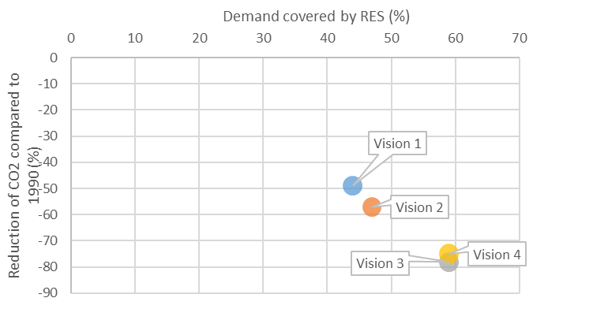
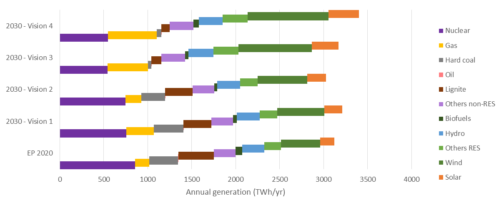
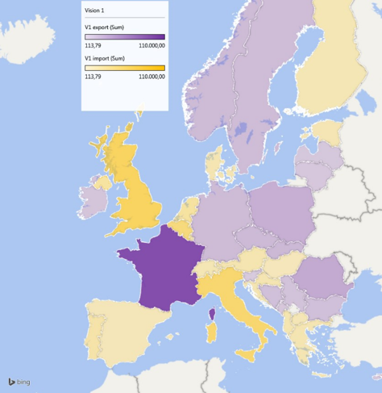
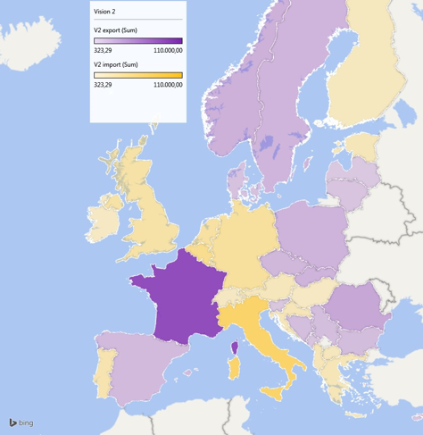
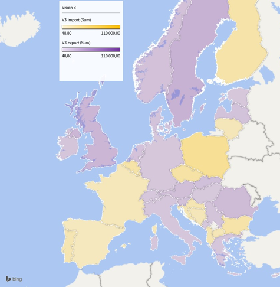
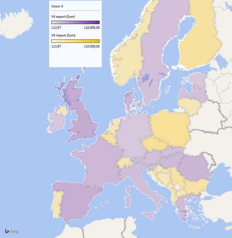

# The TYNDP:  mapping the Energy Union

> “The EU has set itself the targets, by 2030, of reducing domestic greenhouse gas emissions by 40% […], reaching at least 27% energy savings, [and]at least 27% renewable energy (RES) penetration at EU level”  <cite>(Energy Union Package)</cite>

The Energy Union package sets ambitious goals for the overall energy supply by 2030 in Europe. These goals can however translate differently for the power sector, depending on the implemented energy policy. For instance, a strong switch of end-uses from fossil fuels to electricity, especially in transportation (e.g. electric vehicles) and heat (e.g. heat pumps) by 2030, can compensate the introduction of more efficient appliances, and make electricity consumption go on growing in Europe. High RES development may also appear easier in the power sector. As a result, the same “27/27/40” goals by 2030 for the total European energy supply can result in different scenarios for the power sector alone.

The consultation process on scenario development for the TYNDP 2016 therefore concluded in focusing on an extensive exploration of the 2030 horizon (year N+15), and ensuring continuity with the TYNDP 2014 by only adapting, but keeping the basis of, the storylines of the previous TYNDP four 2030 “Visions”. A new mid-term “Expected progress” scenario (year N+5) is added as an intermediate step to any of the 2030 Visions (The TYNDP is published in 2016, but scenarios are commonly performed in "round years". Therefore, N+15 refers to 2030 (instead of 2031) and N+5 to 2020 (instead of 2030)).

For a detailed explanation of the scenarios, how they were built or to find specific figures, check the [Scenario Report published in 2015](https://www.entsoe.eu/Documents/TYNDP%20documents/TYNDP%202016/150521_TYNDP2016_Scenario_Development_Report_for_consultationv2.pdf)

The 2030 Visions are less forecasts of the future than plausible future states selected as wide ranging possible alternatives so that the pathway realised in reality falls with a high level of certainty within the range described by the Visions. The span of the four Visions is large and meets the various expectations of stakeholders. They differ mainly with respect to:

-   The trajectory towards the Energy roadmap 2050: Visions 3 and 4 maintaining a regular pace from now until 2050, whereas Visions 1 and 2 assume a slower start before an acceleration after 2030. Fuel and CO2 prices favour coal over gas in Visions 1 and 2 than in Visions 3 and 4. 

-   The consistency of the generation mix development strategy: Visions 1 and 3 are based upon each individual country’s energy policies though still with a minimum harmonised approach across Europe; while Visions 2 and 4 assume a stronger top-down pan-European construction, based on new optimisation methods specifically developed for this TYNDP 2016. 

The TYNDP scenarios development supplying __45% to 60%__ of the total annual demand, depending on the Vision. These are paired with a huge reduction in CO2 emissions (__-50% to -80%__ from the 1990 levels, depending on the scenario, see Figure 1). Compared to the TYNDP 2014, the span of the four Visions is of course reduced, adapted to the Energy Union goals by a today closer horizon.

The TYNDP2016 scenarios are also designed to reflect increasing shares of active demand users, concerted efforts to steer storage, and synergies of load and generation by prosumers. These aspects are not placed in a separate scenario, but are intrinsic to the four Visions. From Vision 1 to 4 the share of electric vehicles and heat pumps ranges from negligible to 10% of peak load by 2030. Related to this also the potential for demand response rises from 5% in Vision 1 to 20% in Vision 4. The most RES oriented scenario therefore also covers the most means to accommodate RES at local/distribution levels, with TYNDP results showing the impact on the pan-European transmission grid.

In every Vision, the TYNDP 2016 tests whether the European extra-high voltage grid is capable of transferring power from generation facilities to load centres in numerous situations. It identifies the possible bottlenecks and the associated investment needs, assesses the costs and benefits of (jointly) proposed reinforcements, both for the 2020 and 2030 horizons and puts thus every investment project into a common perspective. Note that the TYNDP covers investment projects covered by clear investment decision or approval, as well as proposals which require further analysis. This TYNDP proposes strategies to meet the EU interconnection targets in every member state, which are set at a ratio of interconnectivity over installed generation of 10% by 2020, and 15% while accounting for trade flows and costs by 2030. 

 &nbsp;

__Figure 1 All 2030 Visions matching the renewables objectives of the electricity system. Note that while in this figure V1-2 and V3-4 seem close, they show a strong differentiation in spatial distribution of generation.__

 &nbsp;

__Figure 2 Annual generation in each scenario – breakdown per technology class__

<!--

-->

 &nbsp;
 &nbsp;
 &nbsp;
 &nbsp;

__Figure 3 - All visions show different views on which countries become importing or exporting on an annual basis. These differences are even more pronounced when looking at hourly flows. All this impacts the various TYNDP analyses of market integration, RES facilitation, and system reliability.__
