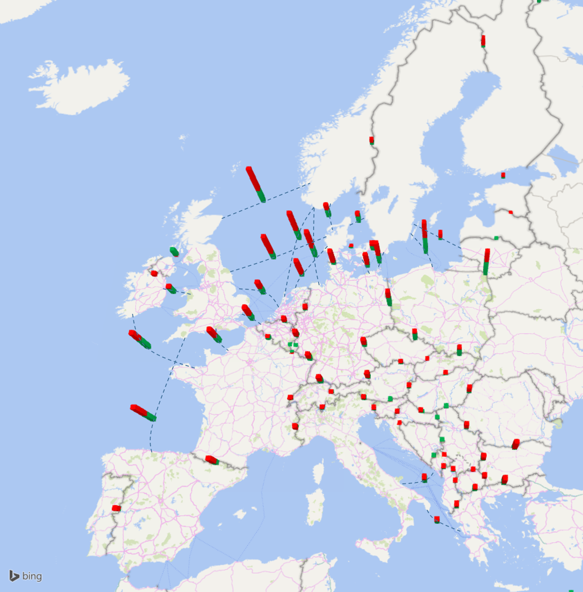

# 27% RES in Europe’s energy supply by 2030 means more grid

> “We concluded that more transmission grid is needed to ensure RES development by 2030; and in this respect they prove relatively cheap, compared to generation and storage”
> <cite>(J. Vande Putte, Greenpeace)</cite>

Variable RES uptake is the major driver for grid development by 2030. The generation fleet will experience a major shift in the next decade with the replacement of much of the existing capacities, probably located differently and further from load centres, and involving high RES development. This transformation of the generation infrastructure is the major challenge for the high voltage grid, which must be adapted accordingly. 

Local smart grids will help increasing energy efficiency and improve local balance between generation and load. Nevertheless, ENTSO-E forecasts larger, more volatile power flows, over larger distance across Europe, mostly North-South driven by the aforementioned energy transition with increasing importance of RES development, and sometimes (depending on the Vision) West-East. The power flows are therefore very large in particular in the high-RES Visions 3 and 4.

Most transmission investments needs are linked to RES integration developments, either where direct connection of RES is at stake or because the network section or corridor is a bridge that links RES and load centres. 
In order to answer these investment needs, the TYNDP 2016 compiles €150 billion investments of pan-European significance[^4], of which €80 billion is for projects already endorsed in national plans and/or intergovernmental agreements by 2030[^2]. The figures are in line with the previous analysis of the TYNDP 2014. This effort is significant for the financial means of TSOs. Still, it only represents about 1.5-2 €/MWh of power consumption in Europe over the 15-year period, i.e. about 2% of the bulk power prices or less than 1% of the total electricity bill.

This investment scheme has however a significant positive impact on the European social welfare. The created market integration will reduce bulk power prices by 1.5 to 5 €/MWh (depending on fuel and CO2 cost assumptions per scenario). This integration effect is also shown in about 40% avoided congestion-hours across all borders in the most conservative scenario.

In addition, it helps avoid 30 to 90 TWh[^3] of RES spillage globally, reducing it to less than 1% of the total supply. In the 50 to 80% of carbon emission reduction in the electricity sector by 2030 compared to 1990, up to 8% is enabled by the TYNDP infrastructure. 

TYNDP2016 market flow studies show that in the various 2030 scenarios the portfolio of mid-term and long-term grid infrastructure investments result in a reduction of over 40 % of the number of congestion hours (As compared to the existing grid situation). This shows the support TYNDP investments bring to a more integrated European energy market. Figure 1 also shows how the TYNDP portfolio reduces border average marginal price differences.), and ensure N-1 security (example give for Vision 3). The individual TYNDP project sheets also give further insight in how marginal price differences across borders fluctuate across the year.

Investing in the project portfolio represents generally a payback for society after 20 years in a rather conservative scenario. The TYNDP 2016 thus confirms the main findings of the previous releases of the TYNDP. It also completes them in new respects by exploring and presenting additional elements.

 &nbsp;

__Figure 4 - Reduction in yearly average of hourly marginal cost spreads in Vision 3, illustrating the benefit of TYNDP investments for European market integration. The total bar height represents the average price spread at each border in Vision 3 without the TYNDP investments; the green bars represent the remaining spread with the market capacity delivered by TYNDP investments.__

__Footnotes:__

[^2]: These projects of pan-European significance must however be completed at regional or national level to achieve an overall consistent development of the whole energy system.

[^3]: Electricity production from RES that is curtailed i.e. which do not reach the consumer due to grid constraints

[^4]: The project costs are calculated at the date of commissioning and are not "2016 euros". In effect, this makes the figure larger than if all costs were discounted to their 2016 value.
