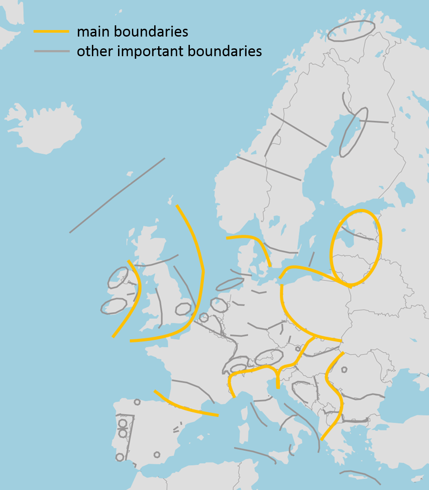

# Main barriers for power exchanges in Europe

> “The stronger the RES development in large scale, the stronger the power flows and the transmission capacity needs from the periphery of Europe, with higher RES potential, towards its heart, where most of the load centres are” 
> <cite>(G. Sanchis, e-Highways 2050 project leader, Nov/15)</cite>

Past releases of the TYNDP used to pinpoint four “electric peninsulas” – namely Ireland and Great Britain, the Iberian Peninsula, Italy and the Baltic states.
The TYNDP 2016 re-confirms needs. The presentation in this edition has been reshuffled in order to ease the 3rd PCI identification process in 2017. In view of the upcoming PCI selection process, it is necessary to guarantee a stable framework as well. Those projects already listed as PCI, and for which a final investment decision has been taken, require no further re-assessment.

This new presentation highlights the main “boundaries” in the European system where projects complete each other to develop the transfer capacity of one corridor; or, conversely, where projects compete with each other, should the target capacity be lower than the capacity delivered by all of them. Other investment needs of pan-European relevance have in most cases only one project at stake, but they can have in principle the same level of priority; even if they are also of high strategic relevance for the development of the infrastructure corridors, they can be reviewed in a simpler manner, independently from all others. The regional reports and project sheets in this TYNDP package give further insight in the relation between these boundaries, identified investment needs, and proposed priority investments.

The main boundaries are as many main barriers to power exchanges in Europe. They obey a globally radial pattern: tensions on the grid occur between regions of Europe, where potential for RES is high (hydro and wind in Scandinavia; wind in Scotland, Ireland, to Spain and Italy; solar in Mediterranean countries) and densely populated, power consuming areas in between. These barriers appear mostly where geography has set natural barriers: seas and mountain ranges, more difficult to cross.

The __ten main barriers for power exchanges__, hence interconnection challenges, are:

-   Wind development in Ireland and Great Britain will create high variations of power infeed on the two Islands, inviting to interconnect them together further (1), and the two with the Scandinavian hydro-storage or to mainland Europe (2)(3), which represents both a large outlet for surpluses or a source for back-up capacity conversely.

-   Further interconnection of Nordic countries and their hydro-storage, with mainland Europe, especially to mitigate wind infeed variations along the North Sea (4) and Baltic Sea (5) coasts.

-   Interconnection of the Baltic states to Europe (part of 5), in order to secure their supply from the West.

-   East and South interconnection of Poland with Germany, Czech Republic and Slovakia (6), in order to increase market capacities. 

-   Interconnection of the Iberian Peninsula with mainland Europe (7), while providing appropriate synergies between the Spanish and Portuguese power systems, where most of solar potential in Europe lies as well as a significant wind potential .

-   Further interconnection of Italy with its neighbouring countries: to link the Italian RES capacities and load with the Alpine hydro-storage on the North frontiers, and to connect the Italian system and main islands to the heart of the European market, to the Balkans and North African countries (8).

-   Further interconnection of South-East Europe with Central Europe, to allow for mutual support (9) nowadays hindered by a low capacity.  

-   Further interconnection across the Balkan peninsula (10), taking advantage of the high RES potential in the East (e.g. Romanian wind, Greek solar) to supply load centres in the West, from Serbia through Montenegro to Italy.

There exists an eleventh boundary between the European ENTSO-E interconnected power system and its neighbours. __Europe could benefit from additional, cheap, generation surpluses at its outskirts, South and East__, and/or exchanging of RES generation in unbalancing situation. This would increase the need for stronger interconnection downstream, on the concerned boundaries mentioned above.

Regarding internal German boundaries, the analysis of TYNDP 2016 show that reinforcements of these do have large European benefits. The TYNDP 2016 therefore underlines the need for realizing the already planned internal German projects, which will resolve future internal bottlenecks. For status of these projects, see the project assessment sheets.

<table style="float:right; max-width:300px;">
  <thead>
    <tr>
      <th>No</th>
      <th>Boundary</th>
    </tr>
  </thead>
  <tbody>
    <tr>
      <td>1</td>
      <td>Ireland - Great-Britain</td>
    </tr>
    <tr>
      <td>2</td>
      <td>Norway and continent - Great-Britain</td>
    </tr>
    <tr>
      <td>3</td>
      <td>Nordic - mainland West</td>
    </tr>
    <tr>
      <td>4</td>
      <td>Nordic - mainland East</td>
    </tr>
    <tr>
      <td>5</td>
      <td>Baltic states integration</td>
    </tr>
    <tr>
      <td>6</td>
      <td>Central East integration</td>
    </tr>
    <tr>
      <td>7</td>
      <td>Iberian peninsula integration</td>
    </tr>
    <tr>
      <td>8</td>
      <td>Italian peninsula integration</td>
    </tr>
    <tr>
      <td>9</td>
      <td>South-East integration</td>
    </tr>
    <tr>
      <td>10</td>
      <td>Eastern Balkan border</td>
    </tr>
  </tbody>
</table>

__Figure 5 Investment needs and boundaries/barriers; ten main ones (yellow) and several regional ones (grey)__

The TYNDP project proposals address these 10 boundaries and barriers, as well as many more regional ones (see Figure 3). The TYNDP analyses give insight in the market/grid capacity enabled by these projects, as well sensitivities for these boundaries. The TYNDP project capacities added up __may be lower or greater than the target capacity that a well-integrated Internal Electricity Market would require__. As set forth in the Energy Union package, the optimal interconnection target capacity by 2030 shall “_take into account the cost aspects and the potential of commercial exchanges in the relevant regions_”. This is specifically what the Cost Benefit Analysis of the TYNDP deals with.
