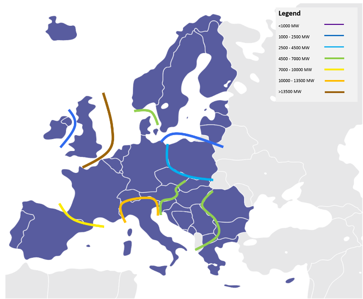
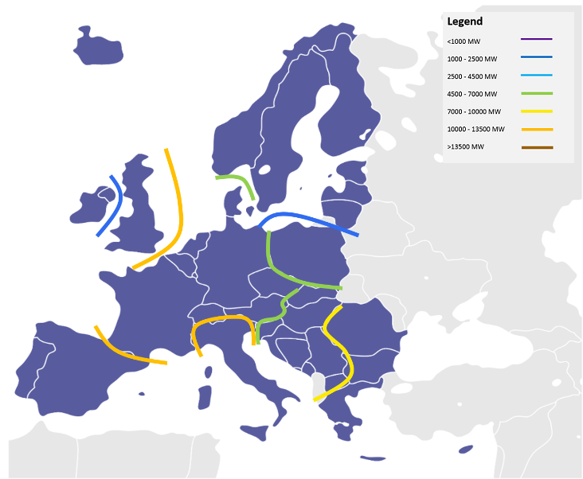
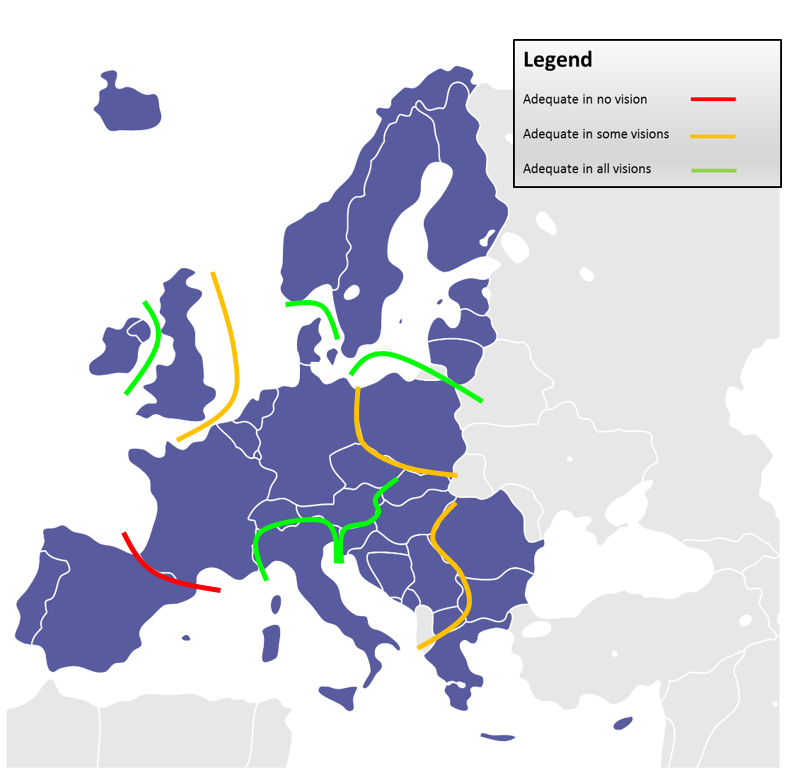

# 2030 targets for interconnection capacities

>“Notes that Europe’s energy system has evolved ... in particular, renewable energy sources have been developed across the continent; recommends, in this context, that the 15 % target, based on installed capacity for 2030, should not stand alone, and that is should be assessed carefully and thoroughly to ensure that it is fit for purpose and is pertinent and feasible; asks ... to assess the setting of regional, complementary targets and to find better qualitative and quantitative benchmarks, such as trade flows, peak flows and bottlenecks, that highlight how much interconnection is needed."
>(European Parliament, ITRE, Dec/15)

Driven by RES development concentrated at a distance from load centres, and allowing for the required market integration, interconnection capacities should double by 2030 in Europe, on average. Discrepancies however, are high between the different countries and scenarios.

The proposed set of projects fulfils the 10% interconnection capacity goal (compared to the installed generation capacity for every Member State) by 2020, with one exception: Spain remains a critical concern in this respect, due to unique technical challenges in the area, and with reinforcement projects scheduled to be commissioned only by the middle of the next decade with enough political compromise.

For all four refined 2030 Visions, the TYNDP 2016 fine-tunes the interconnection target capacities for every main boundary by 2030 reported in the TYNDP 2014, based on additional TSO coordinated studies (see figure opposite). The interconnection level is optimal in this analysis when the societal economic benefits brought by an additional project fail to overcome its costs. This principle however, is complex to implement in practice, and the approach here considered is a simplified one as only SEW is considered. In spring 2016, a dedicated Interconnection Targets Expert Group was set up by the EC in order to provide guidance and explain how accounting for trade flows and costs may make interconnection targets by 2030. The right order of magnitude for reinforcement cost figures are relatively easy to appraise for every border; the main difficulty is a comprehensive appraisal of benefits (strictly financial and others) of projects. 

In particular, the present Cost Benefit Analysis methodology (CBA) is designed for “energy only” environment, where the generation mix is harmoniously developed, and captures operation cost savings in generation in a complete competitive market without considering market agent’s strategies to optimize their project portfolio revenues; it must however be completed by capital expenditures savings in back-up generation capacity, especially in a context of high RES development and another benefits that can be difficult to monetize. The “capacity” and “hedging” value of interconnectors can be significant for islands or peninsulas. It is however difficult to appraise and it is only mentioned as the comments to the CBA of the concerned projects, beyond the strict CBA requirements. 

Therefore, the TYNDP 2016 can only provide an order of magnitude  regarding the interconnection target capacity per border by 2030, with a narrow range depending on the Vision. But it also supplies transparently all computational bricks useful to support the 3rd PCI selection process in 2017. In particular, for every boundary, the relation between annual socio-economic benefits (SEW) is given as a function of the increasing capacity (GTC) and can be compared to the annuity of capex and opex of projects (an estimated opex figure for each project could not be included in this TYNDP. ENTSO-E is working on a methodology to estimate these costs in next versions of the TYNDP).

Such optimal interconnections targets ensure that the corresponding investment in transmission is profitable for Europe. The grid capacity will differ from one place to another, depending on the local environment. Even with such a reinforced grid, there will however remain congestions from time to time (because the additional market convergence benefit is too small to justify an additional investment). And most of the time, power exchanges will use only part of the interconnection capacity, while bulk prices in neighbouring price zones converge (and losses are reduced thanks to the extra capacity). In a well-integrated Internal Electricity Market, it is economically sound that the grid is sized so that the load factor of every grid element is lower than 50%, though it sounds like a paradox (this simplification is used by many TSOs across Europe to dimension their grid). This way though, the grid can at once cope with the volatility of power exchanges (with from time to time very strong flows) and meanwhile mitigate the induced losses (thanks to the extra capacity and hence a lower resistance).

 &nbsp;

__Figure 6 – 2030 Vision 1 Target capacities__

 &nbsp;

__Figure 7 – 2030 Vision 2 Target capacities__

 &nbsp;

__Figure 8 – 2030 Vision 3 Target capacities__

 &nbsp;

__Figure 9 – 2030 Vision 4 Target capacities__

When comparing the four vision target capacities with the TYNDP grid capacities delivered (as assessed via the project CBAs), it gives a view on whether the TYNDP grid portfolio is adequate in all scenarios, part of the scenarios, or none at all.

 &nbsp;

__Figure 10 – 2030 Transmission adequacy__

