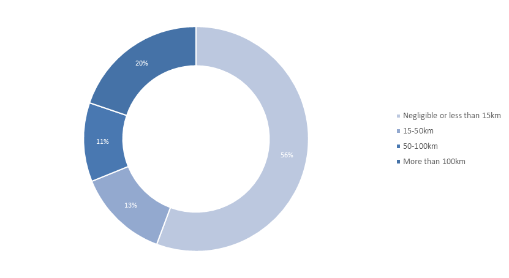
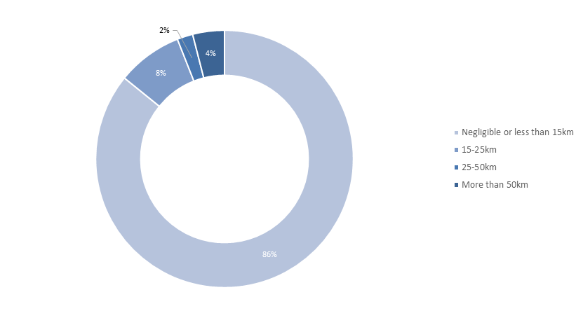

# A positive environmental impact

>“Grids are the enabler of further renewable energy development, thus contributing significantly to the fight against climate change. I am an advocate for strong stakeholder cooperation on all levels of grid planning - from the TYNDP and PCIs to national grid development plans and local projects - because it does not only contribute to gaining public support, but also to the delivery of better projects for the environment.”
><cite>(A. Battaglini, RGI, Nov/15) </cite>

The project portfolio has **a positive environmental impact**.
The grid has an indirect, but essential positive effect on CO2 emissions as it is a prerequisite to the implementation of clean generation technologies. By either directly connecting RES, avoiding spillage or enabling more climate friendly units to run, the project portfolio contributes directly to up to 8% of the CO2 decrease by 2030, and indirectly drives decarbonisation by facilitating RES connection in an integrated European market.

Grid extensions foreseen in this plan represent an increase in the **total network length of less than 1%/yr.** The figure is relatively low, but a must to accommodate **the 1% to 2.5%/yr installed generation capacity growth rate** (depending on the scenario), on top of a transition of the existing fleet. 
Moreover, one third of the new grid asset lengths are subsea cables, and 15% are upgrades of existing equipment. TSOs optimise the routes in order to avoid interferences with urbanised or protected areas as much as possible. In densely populated countries or where a significant share of the land is protected such as Belgium or Germany, this is a challenge. As a result, **less than 4% (resp. 8%) of the total routes of TYNDP projects cross urbanised (resp. protected) areas**, i.e. less than 2000 km (resp. 4000 km).  

**Transmission losses are not expected to vary significantly** in the coming 15 years with the implementation of the plan as multiple effects will neutralise each other. On the one hand, building new transmission facilities or shifting voltage levels upwards reduces the overall electrical resistance of the network; on the other hand, the relocation of generation facilities further from load centres, specifically for wind or hydro energy, increases the transmission distance and system losses. HVDC interconnectors on average (and especially for long distance projects) have a more substantial loss increase as compared to other TYNDP projects.

**Projects of pan-European significance are hence key to make an energy transition in Europe possible,** with positive impact on the environment and minimum residual effect.

The energy transition is hindered by project commissioning delays. With still long authorisation procedures, completing grid development in time for RES integration is a challenge. 

A key issue is to make the most complete information possible about transmission projects as easy as possible to access to European citizens that are directly affected by the construction of new lines, in order to foster buy-in for the new infrastructure and political support. In this respect, based on the suggestion of the Network Development Stakeholders Group, the TYNDP 2016 shall provide in every project assessment sheet, on top of the environmental indicators of the CBA, a map depicting the project route and the main sensitive (protected or urbanised) areas. Besides, links to complementary information available locally (in national language) are already provided when available, in order to make the project assessment sheet also useful for local consultation beyond PCI selection. 

 &nbsp;

 &nbsp;

**Figure 13 Breakdown of projects depending on their length across sensitive areas (top chart: crossing environmentally protected areas; bottom chart: crossing dense urban areas)**

