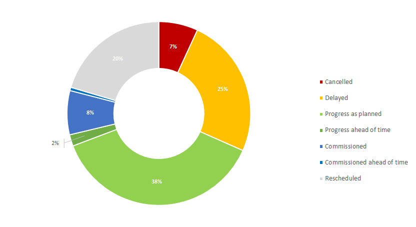

# Energy transition requires grid, grid requires everyone’s support

>“The PCI label will sound great to a banker’s ear… if it was granted for a longer and stable period of time”
><cite>(P. Bernard, Friends of the Supergrid, Jun/15)</cite>

The TYNDP 2016 unfortunately confirms the trend identified in the previous TYNDPs, with moderate progress: about 25% of TYNDP investments suffered delays in past two years (compared to 33% in 2014), though more are being rescheduled (22% now compared to 12% in 2014). TYNDP monitoring also shows that of the TYNDP2014 investments in a design or permitting stage two years ago, at present 20% are under construction, and 5% has been commissioned. Making the comparison with TYNDP2012, these levels are respectively 30% and 10%. Implementation monitoring also shows that of the TYNDP2016 investments presently in design or permitting phase, on average these items have faced a delay of 1 year since 2014, and 3 years since 2012. 

**The framework for Projects of Common Interest (PCIs) is promising** but is only beginning to generate its effect and taking momentum. It is still being implemented, with first annual feedbacks from EC to Members States about implementation and tuning. All OR most PCIs now in the authorisation process appear to meet the 3,5-year timeframe set for getting all authorisations. Still the alignment of national procedures for cross-border projects may require further harmonisation, as some authorisations may fall off the 3,5-year timeframe. Experience will show where inconsistency issues may require improvements in the future.  It is also important to note that PCI best practices could be applied to national transmission projects which are crucial to the achievement of Europe’s targets for climate change, renewable energy and market integration.

Connecting Europe Facility, the European Bank for Investment and specific funds are ready to support project promoters. **Financing becomes less of a structural issue**, but can remain critical for some projects. 

Still, **a stable regulatory framework** is essential to ensure grid reinforcement can be completed in time. In this respect, the PCI 2-year review could be improved by focusing, aside from new candidates, on PCIs affected by a change of consistency or commissioning date (or pre-defined additional conditions). In other words, a PCI would keep its label as long it stays on-track, securing the perspective of the concerned investors, which is the first key for success. In practice, PCIs post final investment decision (FID) would focus on construction, with a due reporting but sparing the resources needed for re-assessment.

The second key is to foster a better understanding of why’s and how’s of projects and **support from local citizens and politicians.** Some project promoters developed **innovative solutions** to bring the project local credit: dedicated citizens’ jury, national parliament’s support, holistic area development scheme along the project route, crowd-funding of transmission projects… Every solution today depends directly on the project background. They are also being further structured through R&D projects (e.g. Best path, Best grid), debated at conferences and may soon get maturity. 

ENTSO-E hence welcomes the creation of the **Copenhagen Infrastructure Forum:** it will be a key tool to share experience, suggest improvements to the legal framework, and catalyse the implementation of innovative project management.

If energy and climate objectives are to be achieved, it is of utmost importance to get **political support on all levels.**

 &nbsp;

__Figure 14 Evolution of TYNDP 2014 project portfolio__

 &nbsp;

__Figure 15 - Additional grid transfer capacities introduced by TYNDP investments in the coming decades; with a note of the present (2016) status of these investments__

&nbsp;

__Figure 16 - Additional grid transfer capacities introduced by TYNDP investments in the coming decades; with a note of the progress since 2014__
