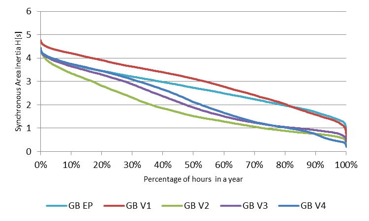
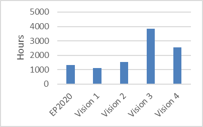

#2030 system operation and market design are still to be invented

>“The traditional assumption that grid inertia is sufficiently high […] is not valid for power systems with high RES shares […]. Frequency dynamics are faster in power systems with low rotational inertia, making frequency control and power system operation more challenging.” 
><cite>(A. Ulbig et al, ETH Zürich, Apr/14)</cite>

45% RES generation by 2030 is a shift of paradigm for the power systems. Stronger interconnection will help Europe make the journey; it still leaves us with many issues to be addressed.

The volatility of RES infeed may result in steep variations of residual load. Added flexibility is required from all system components in operation: conventional generation units, as well as new Demand Side Response schemes or storage facilities. Appraising flexibility requirements falls beyond the possibility of the steady-state analyses of the TYNDP with 1-hour timeframe resolution. The dynamic system behaviour under severe contingencies (and especially the frequency stability) would require also complementary studies. 

The TYNDP 2016 Visions assume that appropriate means to control frequency and voltage will simply be operational by 2030 (e.g IT devices on solar and wind units to simulate inertia to control frequency despite a lower involvement of conventional generation), in part by implementation of pan-European network codes for grid connection, operational guidelines, enhanced TSO/DSO interfaces, and technology progress. This is however a factor likely to challenge the consistency of the generation assumptions[^4].

From today’s situation towards 2030, as the connected capacity of RES increases, and as their contribution to the energy mix increases, the total inertia of the system will be reduced for extended periods of hours if no measures are implemented[^5]. Today’s situation is close to the 2020 views provided in above figures.

 &nbsp;
 &nbsp;

__Figure 17 Percentage of hours in a full year where estimated inertia is above a given value. Synchronous area equivalent inertia H[s] is calculated on the basis of online generators capacity. Examples of Continental Europe and Great Britain synchronous areas. EP2020 and 2030 Visions: V1 “Slowest Progress”; V2 “Constrained Progress”; V3 “National Green Transition”; V4 “European Green Revolution”__

Market simulations mimic an energy-only environment, where all generation means are assumed to be remunerated at the marginal market price. With RES penetration around 50% in the 2030 Visions, the energy-only market fails to pay back generation assets. A key underlying assumption in the TYNDP Visions is therefore that other mechanisms are at play to remunerate generation assets, such as subsidies, Capacity Remuneration Mechanisms or equivalent. 

This means the TYNDP 2016 studies analyse only one part of the total economic value of the power sector. Therefore the projects’ socio-economic benefits computed according to the Cost Benefit Analysis methodology appear under-estimated. This bias of the methodology is on the prudent side. This adds to other methodology assumptions which are already conservative: i.e. the marginal assessment compared to rather high reference capacity regardless of the commissioning time; or a set of less contrasting Visions; or a lower fuel and CO2 prices assumption compared to TYNDP 2014, making the 2030 bulk power flow prices ranging from 50 to 75 €/MWh.

Complementary aspects of many project (its “capacity” or “flexibility” value, e.g. linked to remaining average price differences and price difference standard deviations) are displayed in their project assessment sheet, to enable a complete profitability evaluation in the 3rd PCI list selection debates.

__Figure 18 Number of hours in the 2030 Vision with at least one country having its generation dispatched at zero-marginal cost__

__Footnotes:__

[^4]: Potential power disruption triggered by a lack of flexibility regards Adequacy studies (see Mid-term Adequacy Forecast reports links). They call for appropriate reserve sizing and by exception for additional interconnection capacity.

[^5]: See the Viability of Energy Mix Insight Report for more insights on the technical and economic challenges and what solutions can be implemented to tackle them [link](/insight-reports/energy-mix/)

