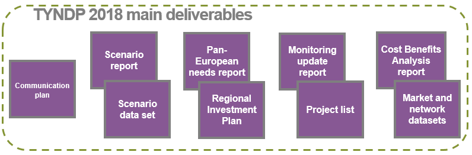
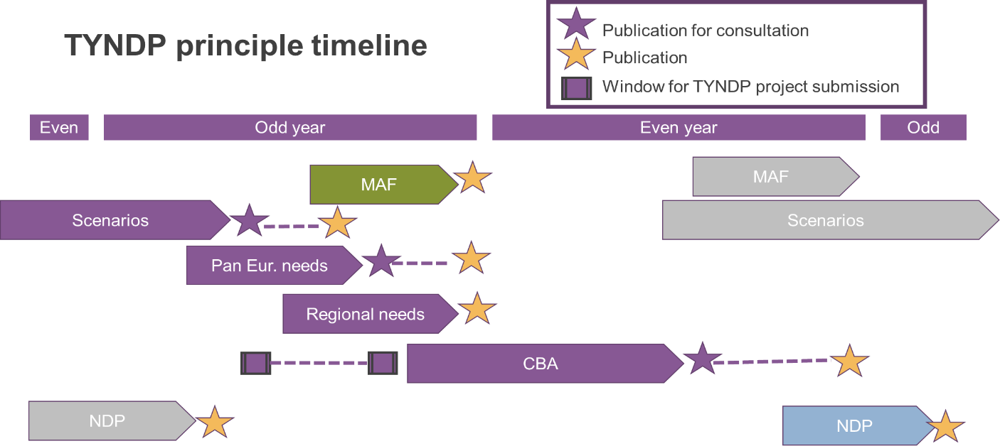
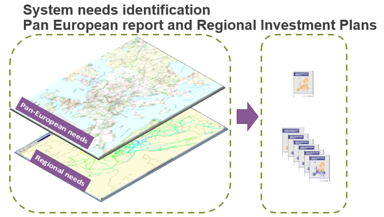

# The TYNDP 2018 is already on the way

>“What we assume today sets the frame under which the future is analysed. This is the reason why ENTSOG encourages all stakeholders interested in the future gas and electricity infrastructures and in scenario development to participate to ENTSOs scenario development process.” 
><cite>(Jan Ingwersen, ENTSOG General Manager, 12.05.2016)  </cite>

An international benchmark in 2015 showed that the European TYNDP stands unique world-wide in terms of number of TSOs collaborating, total number of customers served, methodologies to tackle long-term challenges, and transparency of data and process. 

__Still, the TYNDP is a living object__, bound to evolve to meet stakeholders’ rising expectations. For instance, scenarios storylines will have to answer the still open questions about power system operation and profitability issues that are today answered in a too simplified manner; market modelling will also evolve consistently with raising concerns about security of supply or increasing DSR.

The feedback from the 3rd PCI list selection process in 2017 will also be essential. 

The scope of the TYNDP 2018 can already be outlined. It has been discussed in the Network Development Stakeholders Group, and all stakeholders are invited to contribute to it in the consultations organised by ENTSO-E in 2016[^6]:

-   The two ENTSOs join forces to propose a combined process (scenario building, milestones) to deliver their respective TYNDPs in two-year time. An interlinked gas and electricity modelling shall be finalised in 2016.

-   The TYNDP shall more than ever focus on identifying longer-run pan-European relevance system needs (beyond ten-fifteen years). 

-   The TYNDP will also feed the PCI selection process, by supplying Cost Benefit Analysis of projects expected to be commissioned in the decade or so (hence focusing on five-ten years horizons).

-   The scenario building starteds in May 2016, with a consultation on study horizons and scenarios outline. Recommendation from ACER and EC shall be complied with, especially the articulation with the Mid Term Adequacy forecast by 2025), and the reference to EU PRIMES scenarios for 2030. In order to maximise output and resources utilisation, ENTSO-E recommends to explore new 2040 scenarios and corresponding investment needs; and make projects CBA assessments for two mid-term study years (2025, 2030). The “Scenario development report” will be compiled and consulted first half of 2017.

-   The identification of system needs would rely basically on pan-European market-studies (in order to derive target capacities, but also indicators about system inertia, ramps, adequacy issues, etc.), prolonged with regional analyses, in particular regional network studies (in order to characterise better every need, possibly analyse the evolution from ten-year to longer run horizons, and possibly propose reinforcement concepts). The “identification of system needs” package (one pan-European report and regional investment plans reports) shall be compiled and consulted end-2017.

-   The Cost Benefit Analysis is updated in 2016, with a first draft put in consultation by ENTSO-E in Spring and will be submitted to ACER and EC later for validation and implementation for the TYNDP 2018.

-   The TYNDP 2016 experience shows that the list of projects and target capacities by 2030 are stable enough so that the reference grid, compared to which CBA will be performed. Subject to the dedicated EC guidelines, ENTSO-E proposes to organise two windows for project promoters to ask for TYNDP assessment, one in June 2017 (based on which the reference grid will be set up), and one in December 2017, before the end of the assessment phase in June 2018.

The next steps will be based on feedback received in order to make the TYNDP 2018 best suited for its time. 

 &nbsp;
 &nbsp;
 &nbsp;

__Footnotes:__

[^6]: On the present TYNDP 2016, on the CBA 2.0, or on the scenarios for the TYNDP 2018.
