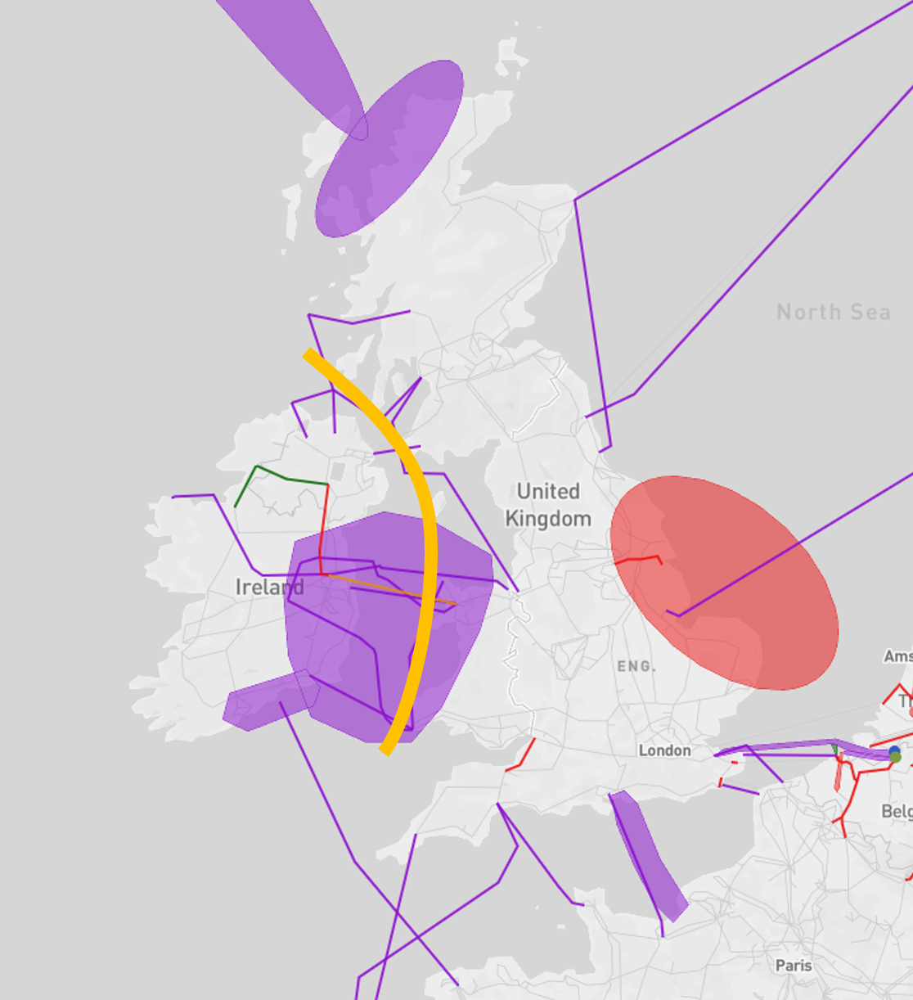
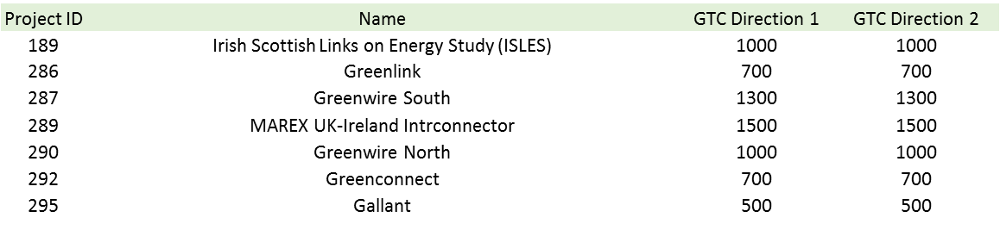

# Ireland - Great-Britain

*Stronger interconnection of the Irish and Great Britain systems, taking account of an overall integration with Continental Europe and the Nordics.*

Two 500 MW HVDC interconnectors currently exist between both jurisdictions in Ireland (IE/NI) and GB. Numerous third party future projects are proposed for this border in TYNDP 2016; in general, these projects make use of potential renewable resources within the island of Ireland to supply GB.

**TYNDP findings**

 &nbsp;

The analyses show that projects across the Irish Sea have high benefits. Some of the proposed projects are additionally connected to wind energy production, exploiting related benefits.

**Welfare and Capacity**

The detailed TYNDP project CBAs show that the future projects typically provide SEW contributions of 20 – 50 MEuro/year, however, those projects which incorporate large quantities of additional renewable generation provide over 200 MEuro/year. 

For nearly all Visions the energy balances across the Irish Sea differ, leaving price differences between Great Britain and the island of Ireland. These differences drive the SEW values. In Visions 1 and 2, Great Britain is an area of deficit, but an area of surplus in Visions 3 and 4. The island of Ireland is always an area of surplus, except in Vision 2.

**Interconnection target for 2030**

The large RES resource of the island of Ireland, as well as potential large scale demand connections, could drive significant interconnection requirements into the future. A Capacity Analysis curve has not been created for this border, and no definitive 2030 target is provided here.

 &nbsp; 
