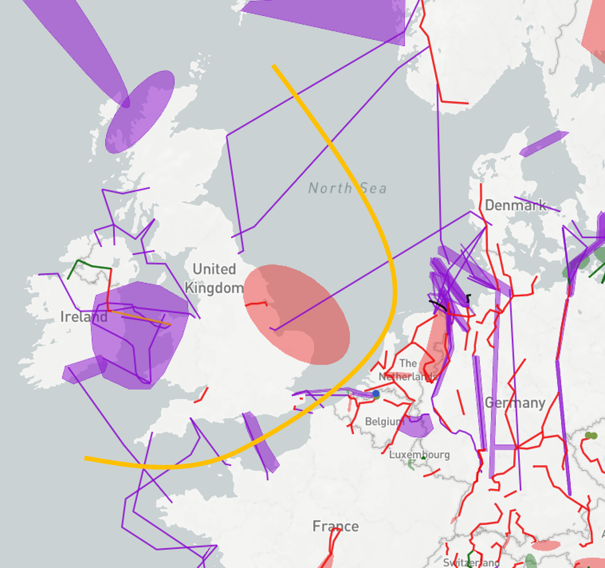
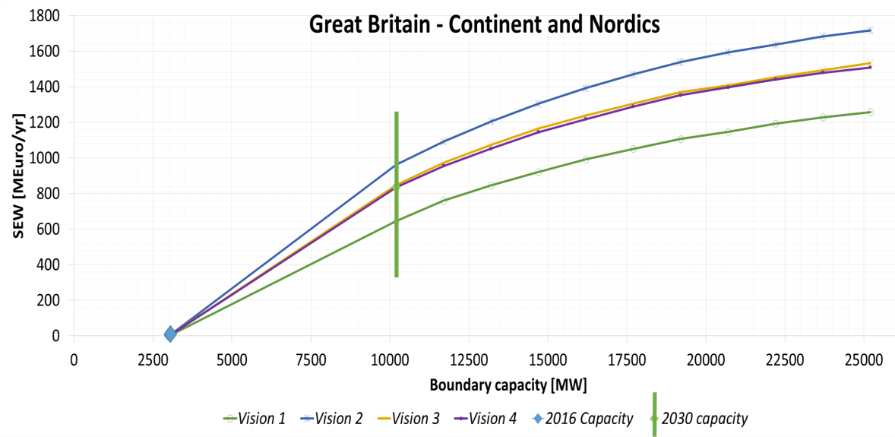
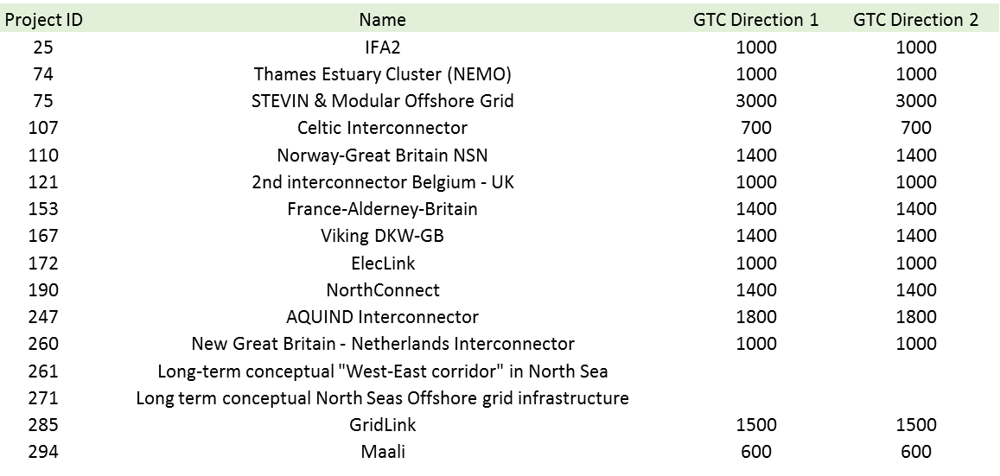

# **Great-Britain – Continental Europe and Nordics**

*Linking the markets of Great Britain with Continental Europe and the Nordic region.*

The generation shift from coal to gas and from thermal to renewables is the main driver for increasing interconnection capacity between the different systems making up the North Sea region. Integrating the British system towards both the Continental and the hydro-based Nordic system, allows to benefit from the complementariness between their generation mix structures. Hence, developing new interconnections across this boundary is important to achieve the desired European market integration as well the integration of renewable energy, preparing for a power system with lower CO2-emissions for most of the Visions. Investments in the boundary play a key role in developing the Northern Seas Offshore Grid Infrastructure and will improve security of supply in the whole region, e.g. during times of low wind, high demand, dry years etc. Additionally, especially HVDC projects add flexibility to the systems due their controllability.

**TYNDP findings**

 &nbsp;

The analyses show that projects between the Nordic and the British systems do have high benefits, however also high costs due to the long distances. Between the Continental and the British systems, depending on the Vision, substantial price differences remain,.

In gas before coal market conditions, projects between the systems lead to decreased CO2-emissions. However, in visions with low CO2-prices where coal is cheaper than gas as e.g. in Vision 1, the projects may lead to an increased coal-fired production and subsequently increased CO2-emissions.

**Welfare and Capacity**

 &nbsp;

Market based capacity analysis performed in the TYNDP2016 shows a significant potential for increasing the capacity between the British, the Nordic and the Continental systems. At the same time, it is important to pay attention to the scenario assumptions. Bringing CO2, oil- , gas-, coal-prices down to 2016-level will influence the SEW-values in a negative direction. Having a look at the Socio-Economic Welfare (SEW) related to increasing boundary capacity, the values of the different visions indicates that the energy-balance is the main driver for price differences hence they drive the SEW-values.

Great Britain is a deficit area in Visions 1 and 2, less in Vision 2 than in Vision 1 given the higher amount of offshore wind, mainly importing from the Continent. In the more greener Visions 3 and 4 Great Britain turns into a surplus area, mainly exporting to the Continent.

Today’s capacity across the boundary is 3GW (blue dot), while the reference capacity of 2030, including all TYNDP16 mid-term and long-term projects, is about 10 GW (green vertical line). Projects not being part of the reference capacity, usually less mature projects or those being built beyond 2030 are indicated to the right hand side from the green vertical line.

**Interconnection target for 2030**

Making the balance between social welfare gain and infrastructure investment costs for higher levels of interconnection, the level of interconnection is above 10 GW for all Visions. The present and planned investments show that the reference capacity might be reached by 2030, even though this includes projects of more than 7 GW.

 &nbsp;
