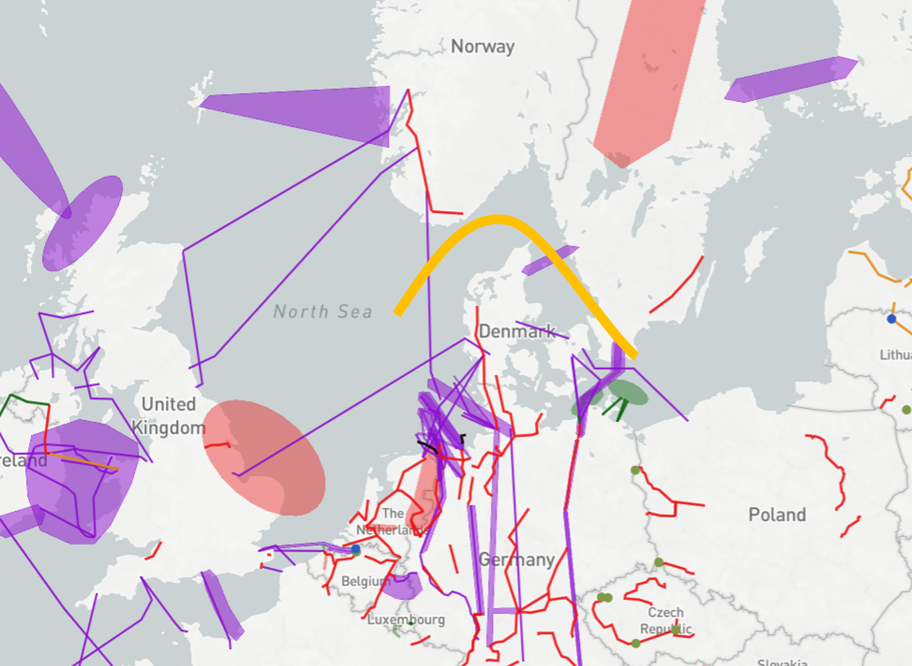
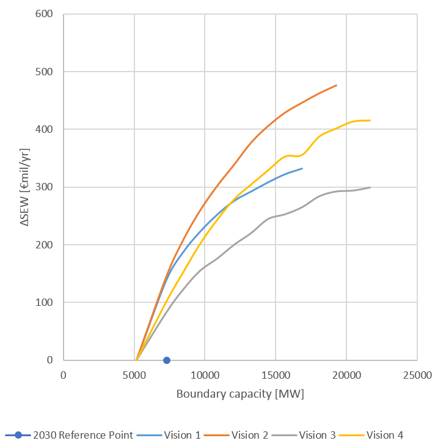
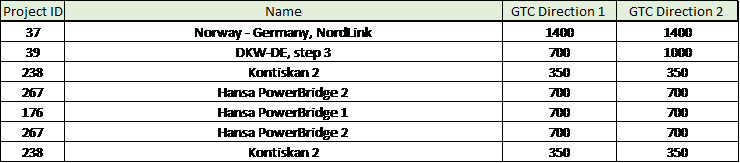

# **Nordics - Continental Europe West**

*Interconnecting the hydro-based Nordic system (NO/SE) with the thermal/nuclear/wind-based Continental system*

The main drivers for investments in this region are to integrate the hydro-based Nordic system with the thermal/nuclear/wind-based Continental system. This will improve security of supply both in Norway/Sweden in dry years as well as for the Continental system in periods with negative power balance (low wind, high demand etc.). Additionally the boundary is important both for the European market integration, facilitating renewable energy and preparing the power system with lower CO2-emission.

**TYNDP findings**

The analyses show, that projects between the Nordics and the Continental system do have a reasonable good socio-economical cost/benefit ratio. However, the values are very dependent of the basic price-assumptions (CO2, coal, gas) as well as the energy-balances in each system hence the price-differences between the systems.

In general, projects between the systems leads to decreased CO2-emissions. However, visions with low CO2-prices, may lead to increased coal-fired production and subsequently increase CO2-emissions.

**Welfare and Capacity**

 &nbsp;

Market based capacity analysis performed in the TYNDP2016 show the potential for increasing the capacity between the Nordics and the Continental system. At the same time it is important to pay attention to the assumptions. Bringing CO2, oil-, gas-, coal-prices down to 2016-level will influence the SEW-values in a negative direction. Having a look at SEW/GTC-values of the different visions indicates that the energy-balance of the different visions both for the Nordics and Continental countries is the main driver for price differences in the visions hence they drive the SEW-value of connecting the Nordic and continental systems. The Nordic surplus is very high in Vision 2, which results in a high price difference and subsequent high SEW/GTC-value.

 &nbsp;

In general SEW-values for projects towards the Nordics are underestimated, this based on the fact that the studies only take into account an average hydrological year.

**Interconnection target for 2030**

Making the balance between social welfare gain and infrastructure investment costs for increasing levels of interconnection, the optimal level of interconnection ranges from 4,5 GW to 7 GW. The present and planned investments show that the target capacity will be reached by 2030.

 &nbsp; 
