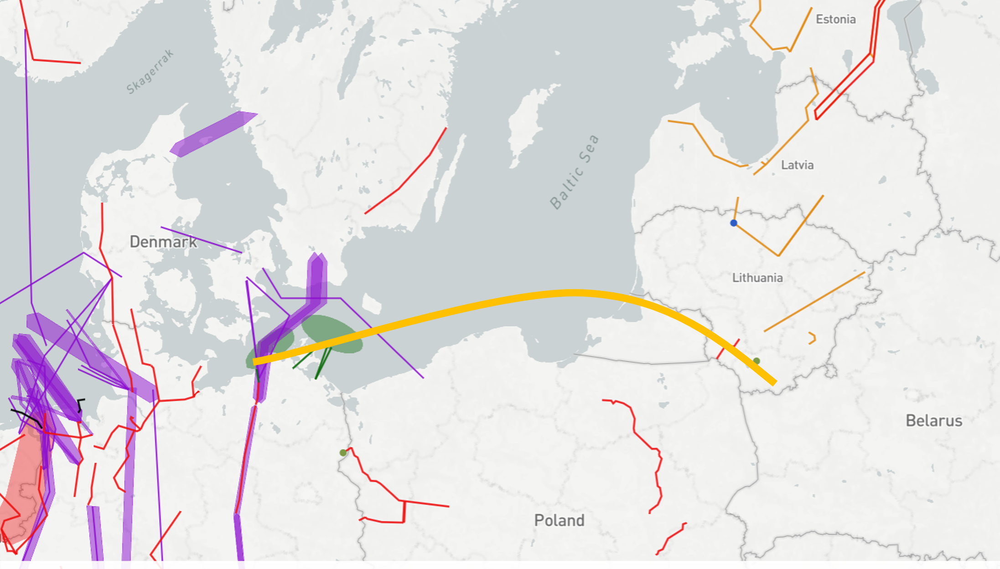
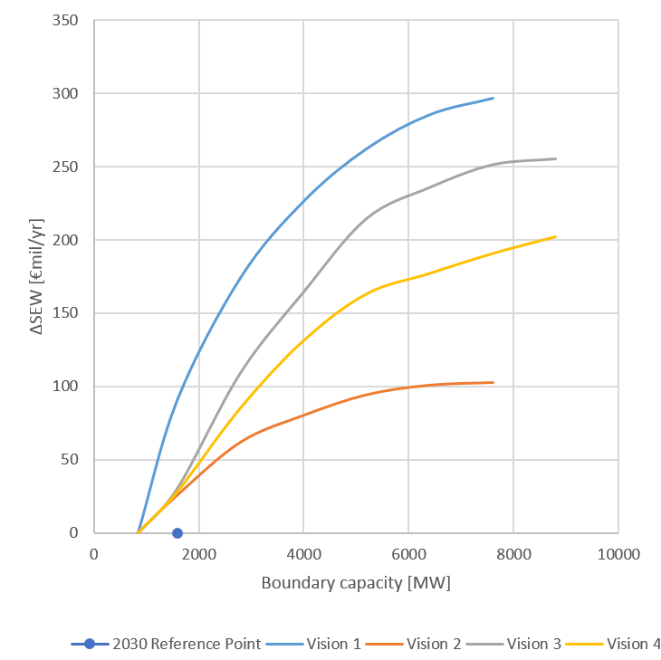
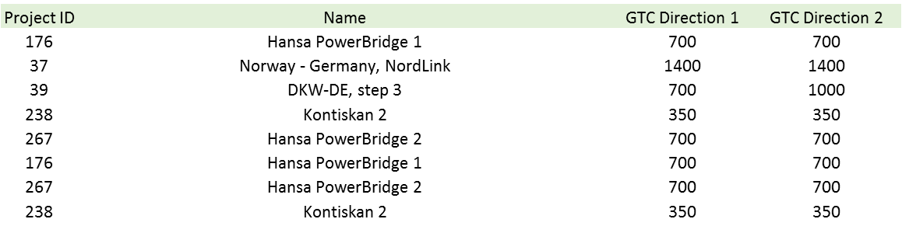

# **Nordic to Continental Europe East**

*Enhancing market flows between North and South, including stronger interconnection of the thermal-based Polish system*

The drivers for investments in this region are:
  1. To decrease price-differences between the Nordics and the Eastern part of the Continental system as well as decrease overall CO2-emissions.

**TYNDP findings**

 &nbsp;

The analyses show a large potential for decreased CO2-emissions when integrating Nordics towards  Continental Europe East. However, the emissions are dependent on the visions. Low CO2-prices leads to increased coal-fired production hence increased emissions. 

**Welfare and Capacity**

 &nbsp;

<u>Nordics towards Continental Europe East</u>

Detailed TYNDP project CBAs show that the average SEW contributions per project across this boundary range from 35 to 80 MEuro/year. This corresponds to about 50 MEuro/year per additional GW of transfer capacity.

**Interconnection target for 2030**

Making the balance between social welfare gain and infrastructure investment costs for increasing levels of interconnection, the optimal level of interconnection ranges from 1 GW to 2,5 GW between the Nordics/Baltics and the Continental Europe East. Compared to the present and planned investments this shows a potential for further projects.

 &nbsp;
