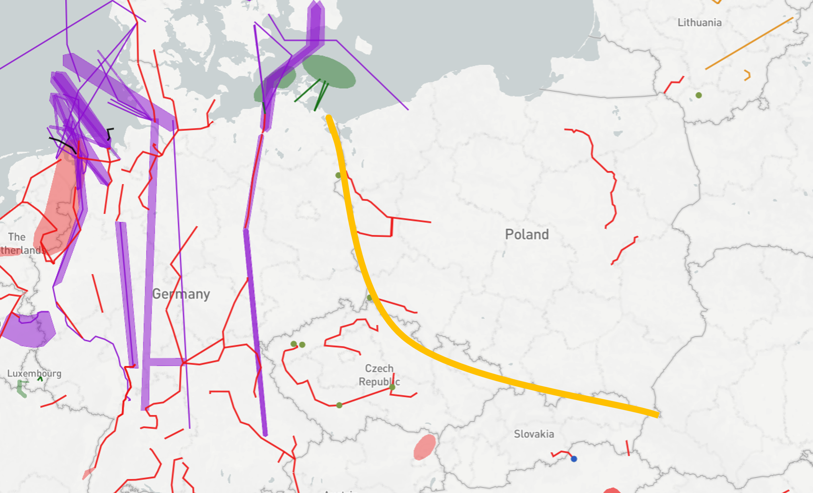
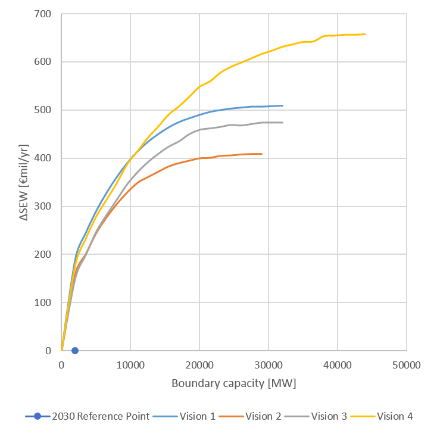
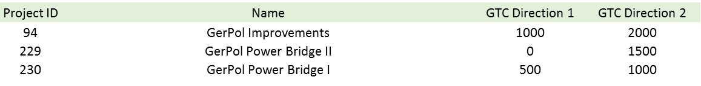

#**Central East integration**

*Strengthening the grid in Central Eastern Europe between Germany, Czech, Slovakia and Poland.*

The driver for investments in this region is to decrease price-differences between the Poland and the neighbouring countries as well as increase security of supply.

**TYNDP findings**

 &nbsp;

The analyses show that high dependency of prices in Poland are strictly relevant with CO2-prices. Self-sufficiency of Poland allow sustain on high level the security of supply at the expense of high energy prices. The emissions are dependent on the visions, where low CO2-prices leads to increased coal-fired production hence increased emissions. Implementation in Poland high efficiency coal technology allow decrease level of emissions significantly.

 &nbsp;

**Welfare and Capacity**

Detailed TYNDP project CBAs show that average SEW contributions per project in the perimeter of this boundary range from 40 to 82MEuro/year. This corresponds to about 95 MEuro/year per additional GW of transfer capacity.

**Interconnection target for 2030**

Making the balance between societal welfare gain and infrastructure investment costs for increasing levels of interconnection, the optimal level of interconnection ranges from 2,5 GW to 4,5 GW. Compared to the present and planned investments this shows a potential for further projects.

 &nbsp;
