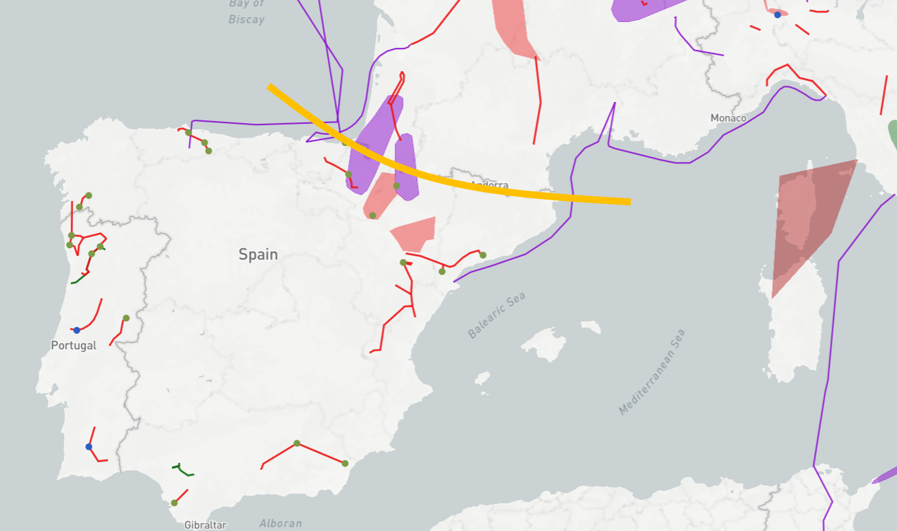
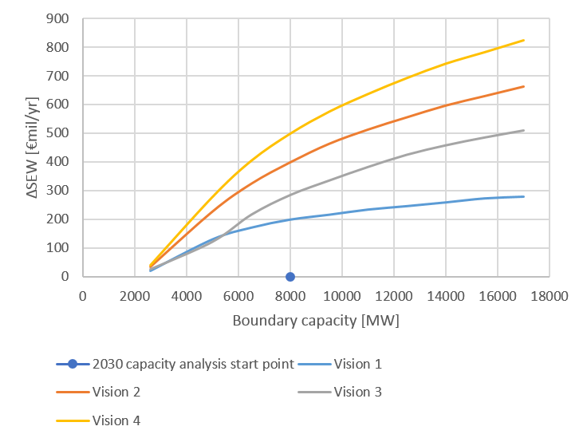
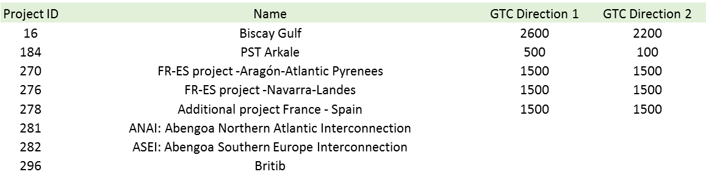

# **Iberian peninsula integration**

*Interconnecting the* *Iberian market (MIBEL)with the rest of Europe.*

**TYNDP findings**

 &nbsp;

This boundary appears since many years as one of the most congested in Europe. Main drivers for grid development are i/the integration of MIBEL to European mainland market; ii/ RES integration, especially in the Iberian Peninsula; and iii/ the need for Spain to comply with the EU 10% interconnection rate target by 2020.

The Madrid Declaration signed in March 2015 by the EC and the French, Spanish and Portuguese Governments shows the strong political will to increase the capacity over this boundary by developing 4 projects (one PST, and three additional HVDC interconnections: one subsea and two terrestrial) on top of the HVDC already commissioned in 2015 on the eastern part of the border.

Three multi-terminal projects promoted by non-ENTSOE members are also assessed as future projects in TYNDP2016 although at the time of closure of the consultation phase these projects did not demonstrate compliance with the EC’s draft guidelines for treatment of all promoters; two of them would connect Spain, France and Great Britain and one Spain, France and Italy

**Welfare and Capacity**

 &nbsp;

**Interconnection target for 2030**

Grid development through this boundary is driven by the compliance with the target interconnection rate of 10% of installed generation capacity for every EU country by 2020, as current ratio for Spain is still far from the target. Depending on the scenarios, the required capacity for 2030 ranges from 9 GW in Vision 1 to 15 GW in Vision 4.

The four projects mentioned in the Madrid Declaration are expected to increase the capacity between France and Spain to 8 GW and therefore this boundary is still marked as inadequate in all scenarios. Nevertheless this huge investment effort from TSOs improves very much the interconnection ratio of Spain (reaching around 9% in Visions 1 and 2 and around 8% and 6% in Visions 3 and 4 respectively).

Notwithstanding, looking at the particular geographical position of the region, if the Iberian Peninsula is considered as a whole (Spain and Portugal), the interconnection ratio would be lower.

 &nbsp;
