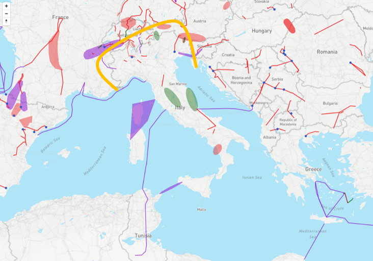
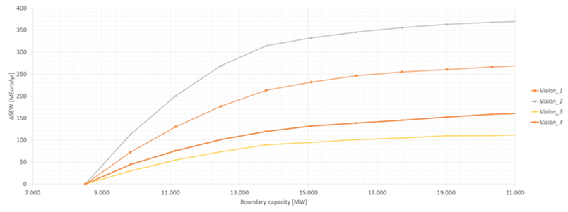
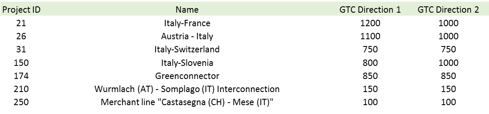

#**Italian peninsula integration**

*Overcoming partial isolation of the italian system*

The main drivers behind the development of the transmission capacity at the North-Italian boundary concern the exploitation of new generation, mainly located in the North of Germany and France (wind) and in the South of Italy (wind and photovoltaic). The interconnection projects planned on this boundary will enable wider power exchanges and, by this way, will make possible to integrate the above-mentioned generation and the pump storage capacity located in the Alps region. 
Furthermore, additional links between Italy and North-Africa and between Italy and Montenegro, will contribute as well to the interconnection of the Italian peninsula, by increasing market integration, RES usage and system security.  
In addition, the SA.CO.I 3 link connecting Italy and Corsica is of major relevance for the security of supply and market integration within the European  system.

**TYNDP findings**

 &nbsp;

The analysis shows that highest SEW/GTC rate is achieved in Vision 2, while the lowest is in Vision 3. 
The higher SEW/GTC values in the V2 and V1 are substantially related to the low CO2 prices used in such scenarios, that lead to a relevant Italian import according mainly to the value of the demand (higher in V2 than in V1). Conversely, in V3 and V4, the higher CO2 prices and the higher RES generation capacity lead to a different use of the Italian Northern boundary, characterised by a lower SEW, but higher RES integration indicators. 
It is also relevant to highlight that, according to the curves described below, the 2030 reference  capacity due to the projects planned on the Northern Italian boundary is quite close to the optimal transmission capacity in the examined scenarios, meaning that any further increase of GTC cannot provide an equivalent increase of SEW.     
Detailed TYNDP project CBAs show that average SEW contributions per project in the perimeter of the Italian Norther  boundary range from 35 to 50 MEuro/year, with higher benefits given by the projects which are commissioned first. 

**Welfare and Capacity**

 &nbsp;

The SEW/GTC curve depicted refers to the impact of reinforcing the interconnection at the North-Italian boundary, the reference capacity reflects the capacity increase on the North Italian Border mainly due to the commissioning of PCI projects. Referring to Italy Tunisia interconnection promoted by Terna, the project is considered mature enough to be included in the reference year 2030 model (expected commissioning in 2022). In the same 2030 reference network interconnections with the balkans (expected commissioning in 2019) and corsica (expected commissioning in 2023) as included as well.

**Interconnection target for 2030**

Making the balance between societal welfare gain and infrastructure investment costs for increasing levels of interconnection, the optimal level of interconnection is around 13.5 GW, which is what the TYNDP portfolio of mid-term and long-term projects aims to deliver.

The following table provides the list of mid and long-term projects on the Northern Boundry and on the other boundaries relevant to the integration of the Italian Peninsula.

 &nbsp;
