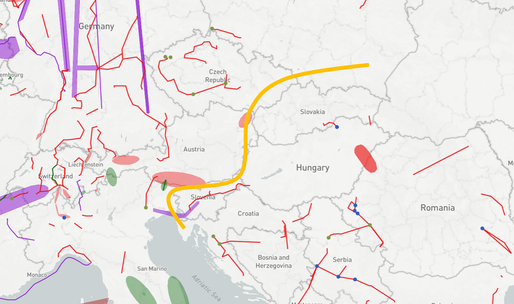
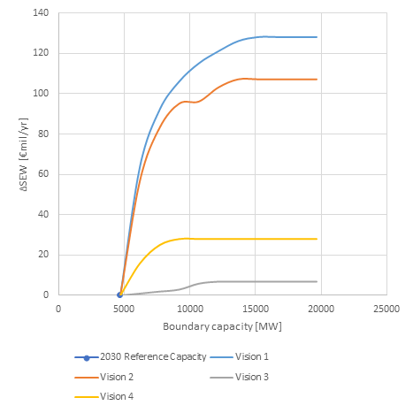

# **South East integration**

*Strengthening the interconnection between IT/AT/SI/CZ and HR/HU/SK in South East Europe.*

The drivers for investments in this region are integrating high potentials of renewables into a relatively sparse network.

**TYNDP findings**

 &nbsp;

The analyses show the relation between additional capacity increases across these borders and the overall welfare gains as a conservative estimates. Linked with presumed project costs in these areas, the earlier TYNDP studies did not identify relevant investment proposals. Hence, no TYNDP projects are proposed at this stage in the TYNDP.

 &nbsp;

**Interconnection target for 2030**

Making the balance between societal welfare gain and infrastructure investment costs for increasing levels of interconnection, the optimal level of interconnection is around 5 GW. This is in line with the present transmission capacities across this boundary.
