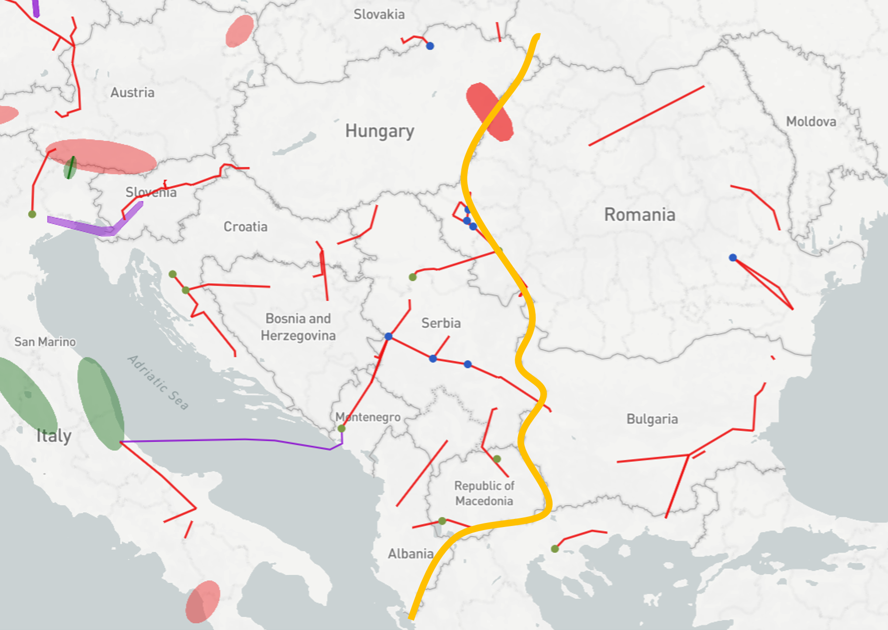
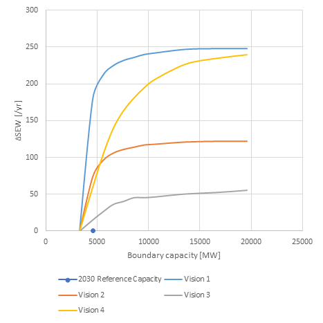
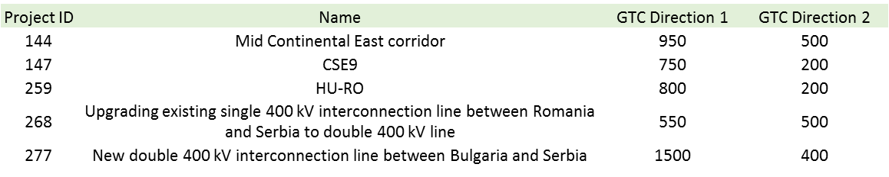

#**Eastern Balkan**

*Strengthening the interconnection from BG, RO and GR to the rest of South-East Europe.*

Strengthening the E→W and the N→S corridors is a prerequisite for market integration and the exploitation of the high RES potential in the East part of South-East Europe. Increase of transfer capacity through the boundary at the West borders of Bulgaria and Romania and the North borders of Greece, will allow the increase of exports to West Europe and, through the Balkan, to Italy both from thermal low cost generation in Bulgaria and Romania and from RES installed in Bulgaria, Romania and Greece, depending on the examined Vision.

**TYNDP findings**

 &nbsp;

The analyses show that increase of transfer capacity over the examined boundary, results in an increase of societal welfare (ΔSEW) in all visions, up to a certain point where the respective variation curve reaches a saturation region. The highest saturation values for ΔSEW appear in Visions 1 and 4.

Detailed TYNDP project CBAs show that average SEW contributions per project in the perimeter of this boundary range from 20 to 50MEuro/year. This corresponds to about 62 MEuro/year per additional GW of transfer capacity.

**Welfare and Capacity**

 &nbsp;

**Interconnection target for 2030**

Making the balance between societal welfare gain and infrastructure investment costs for increasing levels of interconnection, the optimal level of interconnection ranges from 5 GW to 8.5 GW.

Compared to the present and planned investments this shows that in most of the Visions, their implementation will result in a transmission network that is adequate to cope with the expected power flows.

 &nbsp;
